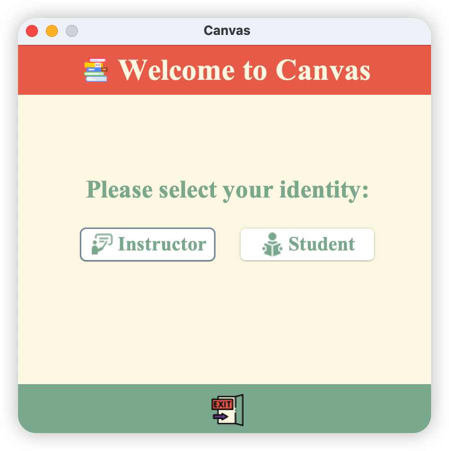
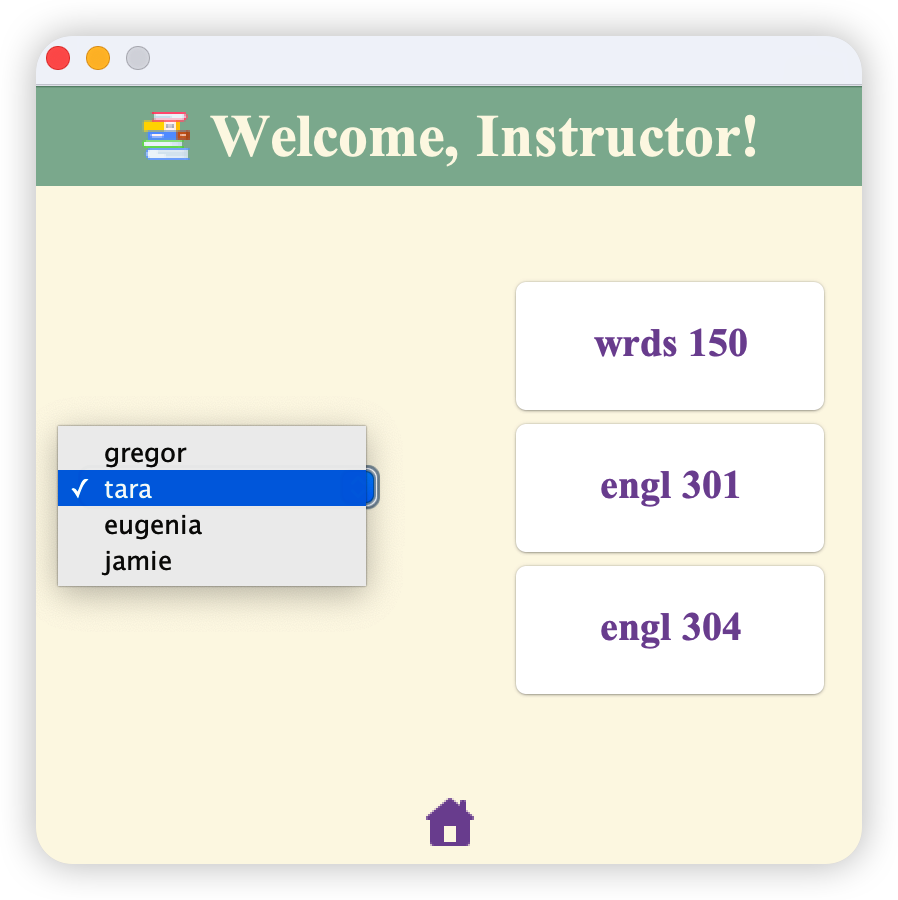
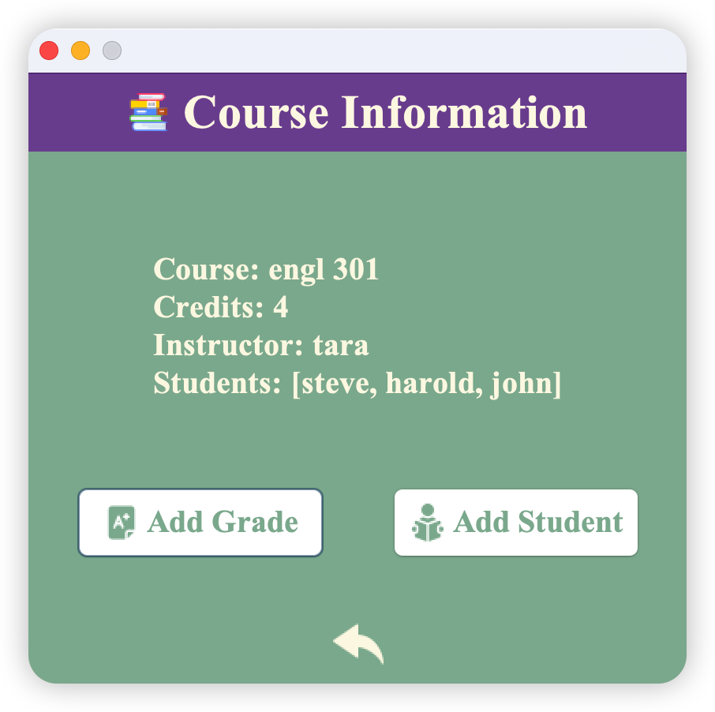
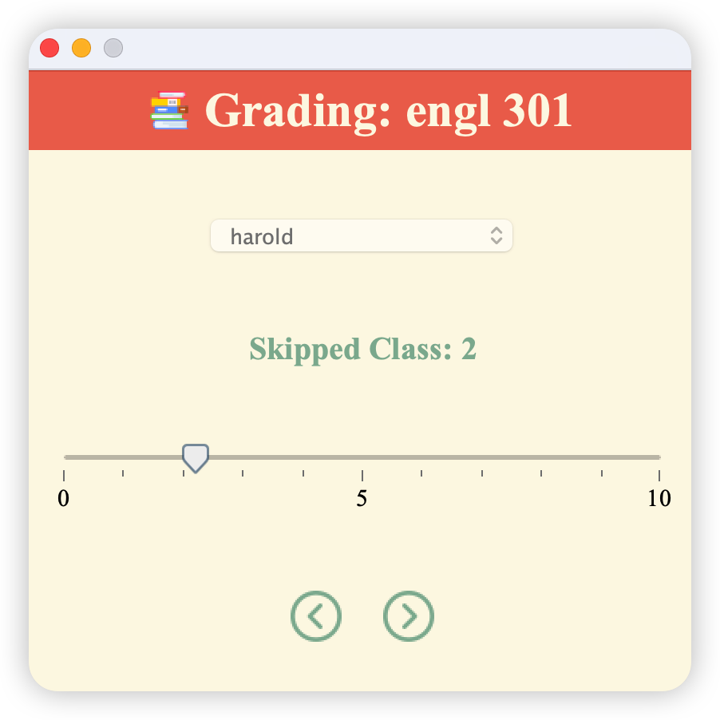
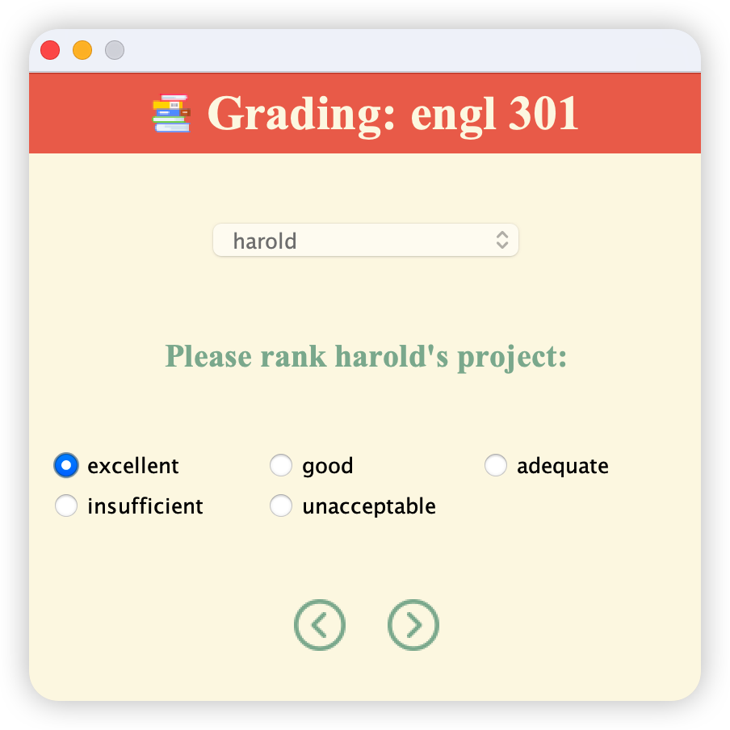
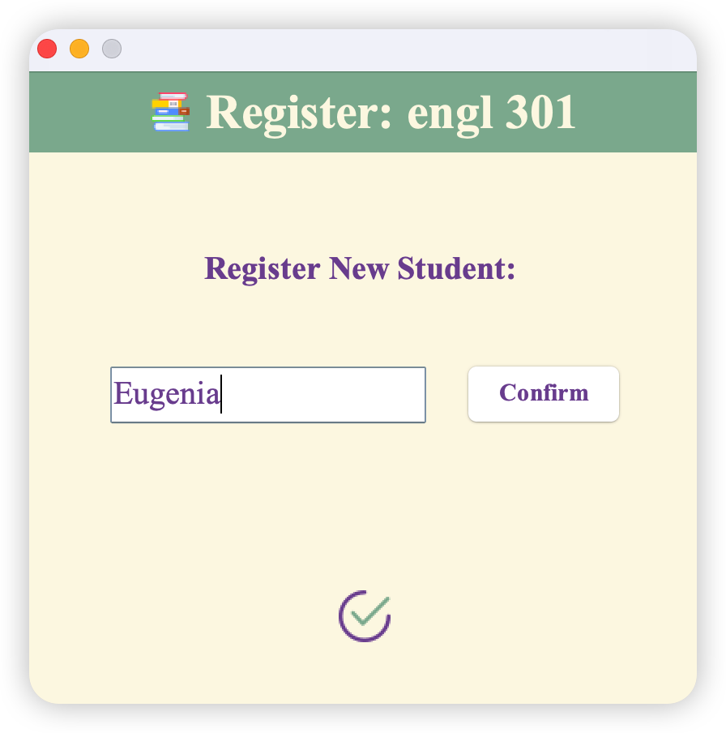
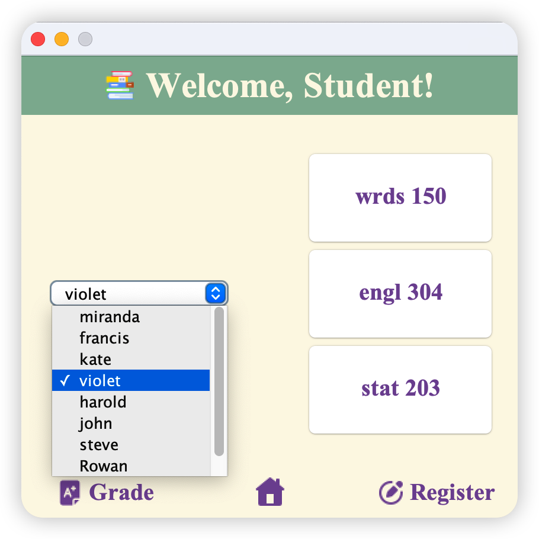
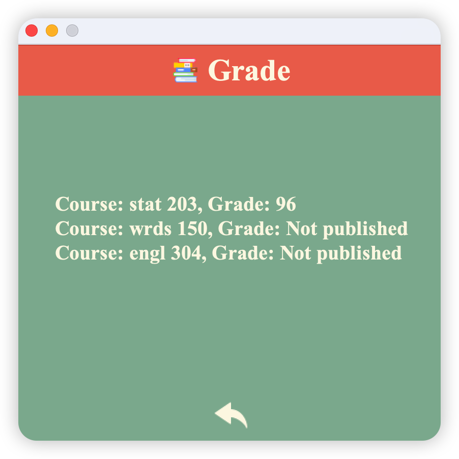
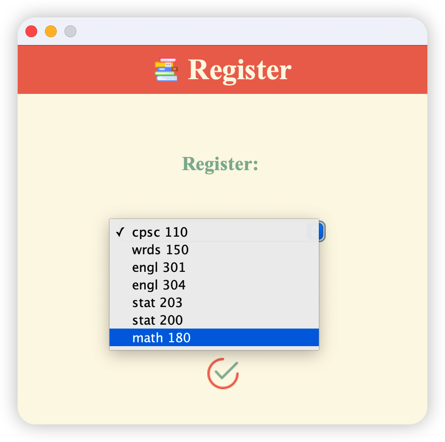

# Mini Canvas: A Course Management Tool

*Given a course ID, extract details of the course.*

## 📚 Description
The goal of this project is to build a tool that is useful to instructors and students in course management. Each course is identified by a unique `course_id` and contains information about the number of `credits` the course is worth, the `instructor` of the course as well as `students` enrolled in this course.

Possible features include:
- Specifying a course to get detailed information;
- Adding a student to a certain course;
- Entering students' grades for each course;
- Visualizing student's grades in a dashboard.

The target is to be able to combine course information and student data for a **full picture** of the course and its activity. Through this project, I will discover valuable connections between CS and my previous studies in education.

 

## 🎬 Demo Video
*Please feel free to turn on the sound.*

https://user-images.githubusercontent.com/81618041/236121322-215152a0-3ed6-4fb8-bcb4-bc038e9f54e3.mp4

 

## 📸 Demo Pictures

   

   

   

 

## 📝 User Stories
- As an instructor, I want to be able to view the list of courses I'm teaching.
- As an instructor, I want to be able to select a course in my database and view the course in detail.
- As an instructor, I want to be able to enter a student's grade in a certain course.
- As an instructor, I want to be able to select a course and add a new student to that course.
***
- As a student, I want to be able to view the list of courses I'm learning.
- As a student, I want to be able to view my grades for all the courses taken.
- As a student, I want to be able to register for a new course.
***
- As an instructor or a student, I want to be able to save the Canvas records to a file.
- As an instructor or a student, I want to be able to load the Canvas records from the file.

 

## 🔭 Technical Skills
- Object-oriented programming (OOP)
- Achieve data persistence using `JSON`
- Develop GUI using the Java `Swing` library

